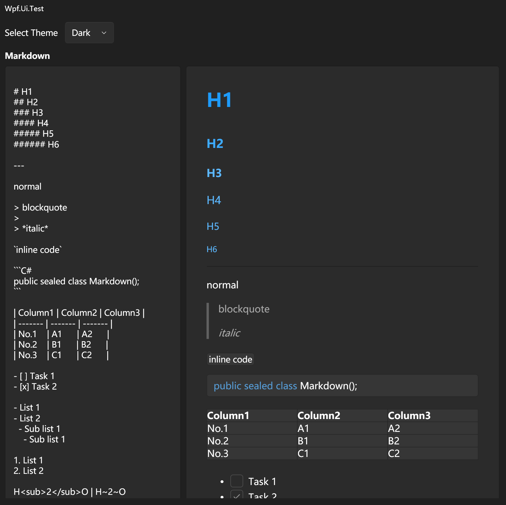

# WPF-UI.Markdown

[](https://github.com/emako/wpfui.markdown/blob/master/LICENSE) [](https://nuget.org/packages/WPF-UI.Markdown) [](https://marketplace.visualstudio.com/items?itemName=lepo.WPF-UI) [](https://github.com/emako/wpfui.markdown/actions/workflows/library.nuget.yml) [](https://dotnet.microsoft.com/zh-cn/download/dotnet/latest/runtime)

WPF UI Markdown is based on WPF UI, and provides the simple markdown viewer.

Pure C# Markdown Viewer without any Webview Engine.

Some Markdown feature are not supported in WPF.

See the [example](src/Wpf.Ui.Markdown/) for how to use.

## Usage

```xaml
<Application
    xmlns:md="http://schemas.lepo.co/wpfui/2022/xaml/markdown"
    xmlns:ui="http://schemas.lepo.co/wpfui/2022/xaml">
    <Application.Resources>
        <ResourceDictionary>
            <ResourceDictionary.MergedDictionaries>
                <ui:ThemesDictionary Theme="Dark" />
                <ui:ControlsDictionary />
                <md:ThemesDictionary Theme="Dark" />
                <md:ControlsDictionary />
            </ResourceDictionary.MergedDictionaries>
        </ResourceDictionary>
    </Application.Resources>
</Application>
```

```c#
<md:MarkdownViewer Markdown="{Binding Markdown}" />
```

## Screen-shot

